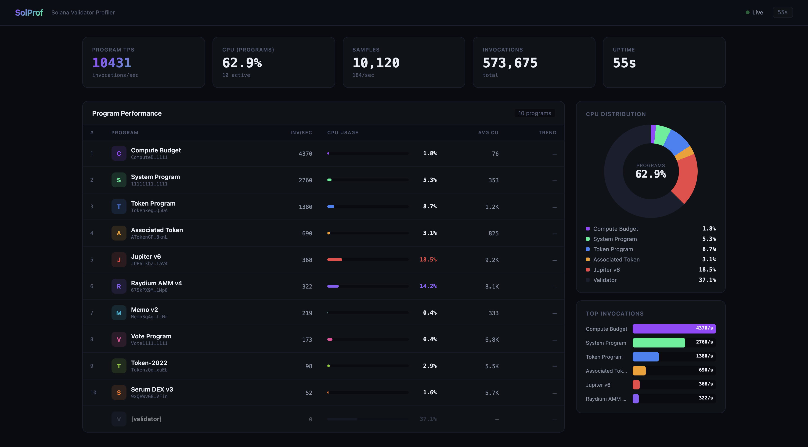

# solana-ebpf-profiler

eBPF-based CPU profiler for Solana validators. Attaches to a running agave-validator (or solana-test-validator), tracks per-program CPU usage via uprobes on `stable_log`, and serves a live dashboard.

No changes to Agave source. No recompilation. Just point it at a running validator.



## what it does

- attaches perf events + uprobes to a running validator process
- tracks which on-chain programs (Jupiter, Raydium, Token Program, etc.) are burning CPU
- generates per-program flamegraphs as SVGs
- serves a live web dashboard with invocation rates, CPU %, avg compute cost, trend direction
- auto-detects the validator binary and PID

## how it works

the profiler uses three eBPF mechanisms:

1. **perf_event** — samples CPU cycles across all cores, captures stack traces via DWARF unwinding
2. **uprobes on `stable_log::program_invoke/success/failure`** — tracks which program_id is executing at sample time, maintains a CPI depth stack
3. **uprobe invocation counter** — counts every program invocation (not sampling-dependent), stored in a BPF HashMap

userspace correlates the perf samples with the active program_id to attribute CPU time. the dashboard polls `/api/stats` every second.

## building

you need nightly rust and bpf-linker:

```bash
rustup toolchain install nightly --component rust-src
cargo install bpf-linker
```

then:

```bash
cargo build --release
```

the eBPF bytecode gets compiled and embedded automatically via the build script.

## running

```bash
# start your validator first, then:
sudo ./target/release/profiler

# or with options:
sudo ./target/release/profiler --duration 120 --period 50000 --port 8080

# custom program list:
sudo ./target/release/profiler --programs my-programs.json
```

the profiler auto-detects `agave-validator` or `solana-test-validator` by scanning `/proc`. if you want to target a specific PID:

```bash
sudo ./target/release/profiler --pid 12345 --validator-binary /path/to/agave-validator
```

### demo mode

runs with simulated mainnet-like data, no sudo needed:

```bash
./target/release/profiler --demo --port 3000
```

open `http://localhost:3000` in your browser.

## dashboard

the profiler serves a React dashboard on port 3000 (configurable with `--port`). shows:

- per-program invocation rate (inv/sec)
- CPU % with inline bar charts
- average compute cost per invocation
- trend direction (CPU going up or down)
- donut chart of CPU distribution across top programs
- top invocations bar chart

all data updates live every second.

## flamegraphs

on exit, the profiler writes:

- `flamegraph.svg` — combined flamegraph of all samples
- `flamegraphs/<program-name>.svg` — per-program flamegraphs (when uprobes are active)

## custom program list

ship a `programs.json` file with your own program IDs:

```json
{
  "programs": [
    { "pubkey": "JUP6LkbZbjS1jKKwapdHNy74zcZ3tLUZoi5QNyVTaV4", "name": "Jupiter v6" },
    { "pubkey": "675kPX9MHTjS2zt1qfr1NYHuzeLXfQM9H24wFSUt1Mp8", "name": "Raydium AMM v4" }
  ]
}
```

pass it with `--programs programs.json`. the default list covers common Solana programs (System, Token, Vote, Compute Budget, Jupiter, Raydium, Orca, etc.).

## CLI reference

```
profiler [OPTIONS]

--pid <PID>                target process ID (auto-detected if omitted)
--validator-binary <PATH>  path to agave-validator binary (auto-detected)
--binary <PATH>            binary for symbol resolution
--duration <SECS>          stop after N seconds
--period <N>               perf sample period (default: 100000, lower = more samples)
--port <PORT>              dashboard HTTP port (default: 3000)
--output <FILE>            flamegraph output file (default: flamegraph.svg)
--output-dir <DIR>         directory for per-program flamegraphs
--programs <FILE>          JSON file with program IDs and names
--demo                     run with simulated mainnet data (no sudo needed)
--help                     print help
```

## project structure

```
profiler-ebpf/     — eBPF programs (perf_event handler, uprobes)
profiler-common/   — shared types between eBPF and userspace
profiler/          — userspace binary
  src/main.rs      — CLI, event loop, flamegraph generation
  src/dashboard.rs — HTTP server, stats computation, React UI
  src/demo.rs      — simulated mainnet mode
  src/programs.rs  — known program registry, JSON loader
  src/symbols.rs   — ELF symbol resolution, /proc/maps parsing
  src/unwind.rs    — DWARF-based stack unwinding
```

## requirements

- linux (tested on Ubuntu 22.04 under WSL2)
- kernel 5.15+ (for BPF ring buffer support)
- root/sudo (for perf events and uprobes)
- nightly rust + bpf-linker

## cross-compiling on macOS

```bash
CC=${ARCH}-linux-musl-gcc cargo build --package profiler --release \
  --target=${ARCH}-unknown-linux-musl \
  --config=target.${ARCH}-unknown-linux-musl.linker=\"${ARCH}-linux-musl-gcc\"
```

copy `target/${ARCH}-unknown-linux-musl/release/profiler` to your linux box.

## license

MIT
